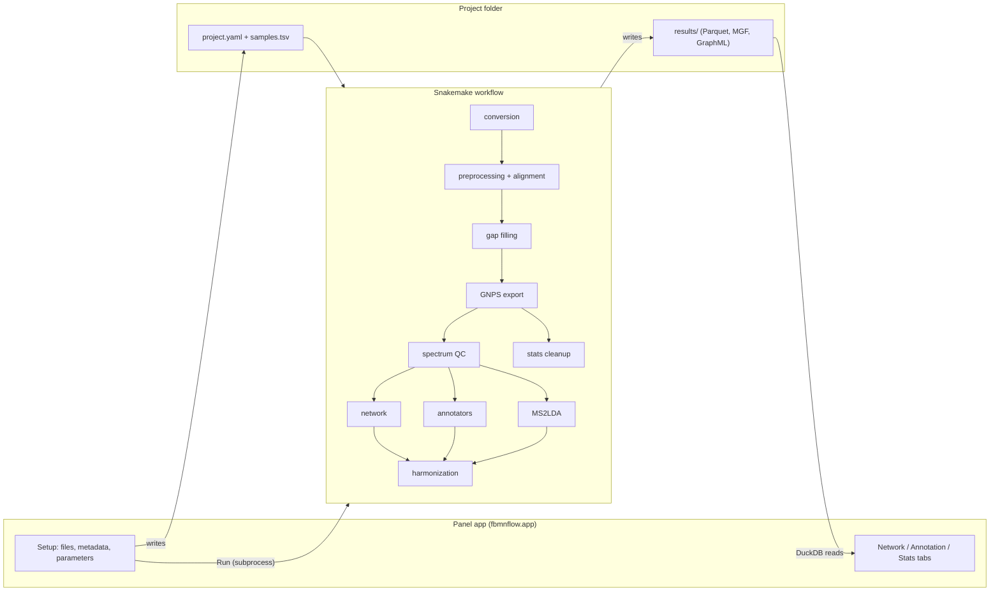

# Architecture — v1 (draft for review)

This document describes how the pipeline is built. The decisions behind it are
recorded in [`CLAUDE.md`](../CLAUDE.md). `fbmnflow` is a working name for the
Python package; renaming it is a search-and-replace.

## 1. Scope

**v1 targets:** Linux, conda environments, local laptop/desktop (GPU optional),
10–100 raw files per project, positive ion mode (polarity stays a parameter),
lipid-focused but usable for general metabolomics, one project open at a time.

**v1 stages:** raw conversion → preprocessing and alignment (pyOpenMS port of
UmetaFlow) → gap filling → GNPS/FBMN export → spectrum QC → network (modified
cosine *or* MS2DeepScore, chosen in the app) → molecular families →
annotation (library search, MS2Query, SIRIUS 6 REST API, lipid module) →
MS2LDA 2.0 → harmonization with Schymanski levels → stats → Panel app →
GraphML / Cytoscape export.

**Deferred to v2** (interfaces leave room for them): MIST-CF agreement flag,
network-aware rescoring of CSI:FingerID candidates, manual curation (incl.
Level 2b), network parameter tuning (done once the first real network exists),
Leiden / graph-tool, DreaMS, SNAP-MS, STEP/MT-GEM, negative mode and
positive/negative merging, Windows, extra database plugins (PubChem,
LOTUS/NPAtlas, COCONUT, GNPS2).

## 2. Big picture



There are three layers, and they only talk to each other through the project folder:

1. **`fbmnflow` Python package.** Holds all the logic and can be tested without Snakemake.
2. **Snakemake workflow.** Handles orchestration. Each rule is a thin script
   that calls the package. Tools with conflicting dependencies run in their
   own conda env.
3. **Panel app.** Edits the project config and metadata, launches Snakemake as
   a subprocess and reads `results/`. The app runs only cheap work itself:
   interactive stats, plots, and the push to Cytoscape.

## 3. Repository layout

```
.
├── CLAUDE.md                  # decisions and conventions
├── docs/ARCHITECTURE.md       # this file
├── environment.yml            # core env (runs Snakemake and the app)
├── pyproject.toml             # the fbmnflow package
├── config/
│   ├── presets/instruments/   # orbitrap.yaml, qtof.yaml
│   ├── adducts/               # positive_lipids.yaml, positive_metabolites.yaml
│   └── lipid_rules/           # diagnostic ions / neutral losses per class x adduct
├── workflow/
│   ├── Snakefile
│   ├── rules/                 # one .smk per stage
│   ├── envs/                  # ms2query.yaml, ms2lda.yaml, conversion.yaml, sirius.yaml
│   └── scripts/               # thin entry points -> fbmnflow functions
├── src/fbmnflow/
│   ├── config.py              # param classes = single source of truth for parameters
│   ├── project.py             # project folder model
│   ├── contracts.py           # table schemas (pure pandas/pyarrow, importable from every env)
│   ├── io/                    # MSP/MGF/JSON library loaders, GNPS export readers
│   ├── preprocessing/         # pyOpenMS wrappers
│   ├── network/               # QC, scoring, construction, families, layout, export
│   ├── annotation/            # plugin base, annotators, lipids/, harmonize.py
│   ├── stats/                 # FBMN-STATS port
│   └── app/                   # Panel app: state.py, tabs/, widgets/
└── tests/                     # pytest, tiny synthetic data
```

Rules running in an isolated env (MS2Query, MS2LDA) import only
`fbmnflow.contracts`, which depends on nothing but pandas and pyarrow. The
Snakefile puts `src/` on `PYTHONPATH` for those rules.

## 4. Project folder

```
my_project/
├── project.yaml          # every parameter (written by the app, read by Snakemake)
├── samples.tsv           # metadata edited in the app: filename, path, sample_type, ATTRIBUTE_*
├── work/                 # intermediates (mzML, featureXML, consensusXML, embeddings)
├── results/
│   ├── gnps/             # quant.csv, spectra.mgf, metadata.tsv, iimn_pairs.csv (GNPS FBMN schema)
│   ├── features.parquet  quant.parquet  spectra_qc.parquet
│   ├── network/          # edges.parquet, nodes.parquet (incl. layout x/y), network.graphml
│   ├── annotations/      # <source>.parquet per annotator, candidates.parquet, best.parquet
│   ├── ms2lda/           # motifs.parquet, feature_motifs.parquet
│   └── stats/            # cleaned_quant.parquet, blank_flags.parquet
└── logs/                 # per-rule logs + progress/<rule>.json for long rules
```

- Snakemake runs as `snakemake --snakefile <repo>/workflow/Snakefile --directory my_project --configfile my_project/project.yaml --sdm conda --cores N`.
- Raw files are referenced by absolute path, not copied.
- `sample_type` takes the values `sample`, `blank` and `standard`. It is the only metadata the pipeline itself needs (for blank flagging). Every `ATTRIBUTE_*` column is only used by the stats and colouring.

## 5. Configuration

- **Single source of truth:** `fbmnflow.config` defines one
  `param.Parameterized` class per stage. The app renders them with
  `pn.Param`, and they serialize to and from `project.yaml`. The Snakefile
  loads and validates the YAML by instantiating the same classes, so the
  parameters are never defined twice.
- **Instrument presets** (`orbitrap`, `qtof`, `custom`) fill in:
  - MS1 mass error (ppm)
  - MS2 fragment tolerance (Da)
  - noise threshold
  - chromatographic FWHM
  - minimum trace length
  - SIRIUS instrument profile

  Orbitrap starting values come from UmetaFlow. Any preset value can be
  overridden.
- **Polarity** drives the default adduct list, the SIRIUS adducts and which
  lipid rule set applies. Only `positive` is fully supported in v1 (the lipid
  rules are positive-mode only).
- **Adducts:** one editable list per polarity, with probabilities. The same
  list feeds MetaboliteAdductDecharger, SIRIUS (detectable adducts) and the
  lipid rules. Default positive list for lipids: `[M+H]+`, `[M+NH4]+`,
  `[M+Na]+`, `[M+H-H2O]+`, with `[M+K]+` optional.
- **Partial re-runs:** parameters are passed to rules as `params`, so
  Snakemake (≥ 8, default rerun triggers) re-runs only the affected rules
  when a value changes in the app. Changing a network cutoff does not
  re-run feature finding.

## 6. Workflow stages

| # | Stage | Env | Main outputs | Notes |
|---|---|---|---|---|
| 1 | Conversion | conversion | `work/mzml/*.mzML` | Thermo `.raw` files → ThermoRawFileParser (bioconda). Bruker/Agilent `.d`, Sciex `.wiff`, Waters `.raw` directories → ProteoWizard msconvert in Docker (`proteowizard/pwiz-skyline-i-agree-to-the-vendor-licenses`, `peakPicking vendor`). `.mzML` files pass through. |
| 2 | Preprocessing (per file) | core | `work/features/*.featureXML` | pyOpenMS: centroid if still in profile mode → precursor correction to MS1 peak → MassTraceDetection → ElutionPeakDetection → FeatureFindingMetabo → feature filter → precursor correction to feature. |
| 3 | Alignment and linking | core | `work/consensus.consensusXML` | MapAlignerPoseClustering (reference = file with the most features) → MetaboliteAdductDecharger per file → IDMapper (MS2 → features) → FeatureLinkerUnlabeledKD. |
| 4 | Gap filling | core | `work/consensus_requant.consensusXML` | UmetaFlow's scheme: FeatureFinderMetaboIdent re-extracts consensus features in the files where they are missing, then decharger → IDMapper → linker again. Missing-value filter at the end. |
| 5 | Export | core | `results/gnps/*`, `features.parquet`, `quant.parquet` | pyOpenMS GNPSMGFFile / GNPSQuantificationFile / GNPSMetaValueFile plus IIMN pairs. We keep the GNPS FBMN schema and don't invent a new one. The Parquet tables are the internal canonical form of the same data. A SIRIUS `.ms` export carries the MS1 isotope patterns. |
| 6 | Spectrum QC and blank flag | core | `spectra_qc.parquet`, `stats/blank_flags.parquet` | Independent filters only: minimum peak count (low default, because lipid MS2 is sparse), precursor intensity, blank ratio (mean blank / mean sample). **Never filter on the similarity score.** The blank flag is computed once and reused by the network, annotation and stats. |
| 7 | Scoring | core | `work/similarities.npz` | matchms. `score = modified_cosine` (fragment tolerance from the preset) or `ms2deepscore` (pretrained MS2DeepScore 2 model, embeddings cached, CPU or CUDA picked automatically). Both can be computed side by side for comparison. |
| 8 | Network | core | `network/edges.parquet`, `nodes.parquet`, `network.graphml` | Top-N pool → score cutoff + minimum matched peaks (cosine only) → top-K per node → iterative removal of the weakest edges while a component exceeds the size cap. Components = molecular families (GNPS definition), Louvain communities inside them (networkx, `resolution` parameter). IIMN adduct edges are kept as a separate edge type. Layout is precomputed per component and packed into a grid, so the app opens instantly. |
| 9 | Annotation | varies | `annotations/<source>.parquet` | See §7 and §8. |
| 10 | MS2LDA 2.0 | ms2lda | `ms2lda/*.parquet` | De novo motifs (number of motifs is a parameter) + MotifDB annotation. |
| 11 | Harmonization | core | `annotations/candidates.parquet`, `best.parquet` | Confidence levels, conflict flags, lipid name normalization, family-level class consensus (MolNetEnhancer logic). |
| 12 | Stats cleanup | core | `stats/cleaned_quant.parquet` | FBMN-STATS steps that don't depend on the chosen comparison: blank removal, imputation, normalization. |
| 13 | Exports | core | `network.graphml` (+ Cytoscape push from the app) | GraphML carries every annotation layer as node/edge attributes. |

**Network starting values** are placeholders taken from GNPS: cosine 0.7,
6 matched peaks, top-K 10, max component 100. MS2DeepScore gets its own
cutoff. As agreed, these are tuned once the first real network exists, and
the tuned values become the preset defaults.

## 7. Annotation plugins

Every annotator is one Snakemake rule that writes
`results/annotations/<source>.parquet` with the shared candidate schema
defined in `fbmnflow.contracts`:

| Column | Meaning |
|---|---|
| `feature_id`, `rank` | feature and candidate rank within this source |
| `source`, `source_version` | e.g. `library:inhouse_std`, `ms2query`, `sirius:csi`, `sirius:canopus`, `sirius:formula`, `sirius:elgordo`, `lipid_rules`, `lipidmaps_ms1` |
| `name`, `smiles`, `inchikey`, `formula`, `adduct` | candidate identity (any of them may be empty) |
| `score`, `score_name` | native score of the tool |
| `matched_peaks`, `mz_error_ppm`, `rt_error_s` | evidence |
| `library_kind` | `experimental` / `in_silico` / `none` |
| `lipid_shorthand`, `lipid_level` | Goslin-normalized name and Liebisch level (category / class / species / molecular species / sn-position / full structure) |
| `classyfire_*`, `npc_*` | compound classes when the source provides them |
| `proposed_level` | the plugin's own Schymanski level (harmonization can only lower confidence, never raise it) |
| `evidence` | JSON blob: matched diagnostic ions, COSMIC confidence, etc. |

Adding a database or API later (PubChem, LOTUS/NPAtlas, COCONUT, GNPS2)
means adding one of three plug-in kinds:

- **(a) SIRIUS custom structure database.** CSI:FingerID then ranks
  structures from that database. See §10.
- **(b) Enrichment lookup by InChIKey.** PubChem synonyms and CID, LOTUS
  taxonomic occurrence.
- **(c) Remote spectral search.** For example GNPS2.

### v1 annotators

1. **Spectral library search (matchms)** covers your MSP, MGF and JSON
   libraries plus public libraries.
   - Candidates are pre-filtered on precursor m/z.
   - Similarity is cosine by default, with entropy similarity as an option.
   - Each library is registered in the app with its kind (`experimental` or
     `in_silico`) and an optional `reference_standards: true` +
     `rt_tolerance`. Level 1 is only possible for those libraries.
2. **MS2Query** (own env) does exact and analog search against its
   GNPS-derived positive-mode library. It also reports cosine and modified
   cosine against the matched spectrum, which the level rules use.
3. **SIRIUS 6 REST API** covers formula + ZODIAC, CSI:FingerID with COSMIC,
   CANOPUS and El Gordo lipids. See §10.
4. **Lipid module**: see §9.

MS2LDA motifs are attached to features as evidence. They never produce an
identity on their own.

## 8. Confidence levels (Schymanski) and harmonization

| Level | Rule in v1 |
|---|---|
| 1 | Match against a library flagged `reference_standards`: MS2 score ≥ cutoff, matched peaks ≥ n, precursor within ppm, **and** RT within tolerance. |
| 2a | MS2 match against an **experimental** library above the same thresholds (no RT), or an MS2Query exact match (precursor Δ within tolerance) confirmed by its cosine score and matched peaks. |
| 2b | Not assigned automatically in v1 (manual curation is v2). |
| 3 | CSI:FingerID top candidate (**capped at 3 whatever the COSMIC confidence**), MS2Query analog, **in-silico** library match (e.g. LipidBlast), rule-based lipid annotation, El Gordo lipid species, CANOPUS class. |
| 4 | SIRIUS formula with ZODIAC score ≥ cutoff. In v2, MIST-CF disagreement **adds a flag and doesn't change the level**. |
| 5 | Exact m/z only (LIPID MAPS m/z candidates are listed as suggestions). |

- **Best annotation per feature:** lowest level first, then a configurable
  source priority, then score.
- **Flags** (they never silently drop a candidate):
  - structure formula ≠ SIRIUS formula
  - CANOPUS class ≠ class of the structure candidate
  - lipid class disagreement between sources
  - RT outlier on the lipid ECN model (§9)
  - feature flagged as blank
- **Lipids report two scales:** each best lipid annotation carries the
  Schymanski level **and** the Liebisch structural level, e.g.
  `L3 · PC 16:0_18:1 (molecular species)`.
- **Family consensus:** per-family class consensus replaces the
  corresponding part of pyMolNetEnhancer (see CLAUDE.md, open item). It
  counts classes per molecular family and scores the consensus, stored on
  nodes as `family_class` and `family_class_score`.

## 9. Lipid annotation

Standard metabolomics tools (MS2Query, CSI:FingerID) are weak on lipids,
because lipid spectra are sparse and dominated by class-specific ions.
Several layers each contribute evidence, and harmonization combines them.

1. **Rule-based annotator** (our own, `config/lipid_rules/*.yaml`, editable).
   - For each class × adduct: diagnostic fragments, neutral losses and the
     expected nitrogen-rule parity, plus a generated species list (class ×
     total carbons × double bonds) matched on precursor m/z.
   - It returns the species level (`PC 34:1`). When chain-specific
     fragments or losses are present it returns the molecular-species level
     (`TG 16:0_18:1_18:2`).
   - Starting positive-mode rule set:

     | Class | Adduct | Evidence |
     |---|---|---|
     | PC / LPC | `[M+H]+` | m/z 184.0733 (LPC also 104.1070) |
     | PC | `[M+Na]+` | NL 59.0735 |
     | SM | `[M+H]+` | 184.0733 + odd nominal m/z (2 N) |
     | PE | `[M+H]+` | NL 141.0191 |
     | PS | `[M+H]+` | NL 185.0089 |
     | PG | `[M+NH4]+` | NL 189.0402 |
     | PI | `[M+NH4]+` | NL 277.0562 |
     | Cer / HexCer | `[M+H]+` | sphingoid base ions 264.2686 / 282.2791 (d18:1); NL 162.0528 for hexose |
     | TG / DG | `[M+NH4]+` | NL of fatty acid + NH3 → chain composition |
     | CE | `[M+NH4]+` | m/z 369.3516 |
     | Acylcarnitines | `[M+H]+` | m/z 85.0284 |

   - The score is the intensity-weighted fraction of expected ions found.
   - Isobars are separated by their headgroup evidence. For example PC 34:1
     and PE 37:1 have the same formula.
2. **In-silico lipid library** (LipidBlast or equivalent MSP) is searched
   with the same matchms engine. Hits are capped at Level 3 because the
   spectra are not experimental.
3. **SIRIUS El Gordo** gives the lipid species in LIPID MAPS notation. It
   also tags CSI:FingerID candidates that match the predicted lipid class
   (`tagStructuresWithLipidClass`).
4. **Name normalization with Goslin** (`pygoslin`, MIT) parses every lipid
   name from every source into one shorthand and Liebisch level, so the
   sources can be compared and agree at the deepest level they share.
5. **RT plausibility (ECN model):** in reversed-phase LC, RT within a class
   rises with chain length and falls with unsaturation. A per-class fit of
   RT against ECN (e.g. C − 2·DB), trained on the confident annotations,
   flags outliers.
6. **Adduct consistency:** IIMN groups `[M+H]+`, `[M+Na]+` and `[M+NH4]+`
   of the same lipid. Class-typical adducts (TG/DG/CE → NH4+, PC → H+/Na+)
   serve as a plausibility check.
7. **LIPID MAPS (LMSD):** a local copy is used for MS1 candidate
   suggestions, as a SIRIUS custom structure DB, and for class IDs through
   Goslin's LIPID MAPS mapping.

**Limit of positive-only data:** many phospholipids (PC especially) give
little chain information as `[M+H]+`, so they mostly stop at the species
level. `[M+Na]+` helps a little. Negative mode (v2) is what unlocks
molecular species for PC/PE/PI/PS.

## 10. SIRIUS integration (new REST API)

- **Packages:** SIRIUS 6.5.x as a local service (`sirius-ms` on
  conda-forge) and the PySirius client (`py-sirius-ms` on conda-forge,
  Apache-2.0). The client version is tied to the SIRIUS version, so both
  are pinned together in `workflow/envs/sirius.yaml`.
- **Starting the service:** the rule starts or attaches to a headless
  service with `SiriusSDK().attach_or_start_sirius(headless=True)`. It
  checks the login first and fails early with a clear message. CSI:FingerID
  and CANOPUS need your SIRIUS account; log in once with the SIRIUS GUI or
  `sirius login`.
- **Import:** our `.ms` export (MS1 isotope pattern + MS2) goes in through
  `import_preprocessed_data`. The SIRIUS feature id is mapped back to our
  `feature_id` through the external id. We don't use SIRIUS's own LC-MS
  preprocessing, so features stay identical everywhere.
- **Job:** one `JobSubmission` covers formula (+ ZODIAC), fingerprint +
  CANOPUS, structure DB search (bio DBs, optional expansive PubChem search,
  custom DBs) and El Gordo lipid tagging. MSNovelist is off by default.
  Progress is polled and written to `logs/progress/sirius.json` for the
  app.
- **Outputs:** formula candidates with the lipid annotation, structure
  candidates (the full list is kept for the v2 network rescoring) and
  CANOPUS classes, all written in the shared candidate schema.
- **Custom DBs:** created once per machine (`create_database` +
  `import_into_database`) and reused by every project. This is also how
  LIPID MAPS, COCONUT and LOTUS structures plug into CSI:FingerID later.

Automated tests use a fake client, because this cloud environment has no
SIRIUS account and no internet access to Bright Giant. Real runs happen on
your machine.

## 11. Panel app

Launched with `fbmnflow app`, which serves on `localhost` and opens the
browser. One project is open at a time.

**Sidebar:** open or create a project, instrument preset, polarity, adducts,
stage on/off switches, key parameters (advanced ones collapsed),
Run / Stop, progress bar and log pane.

**Tabs:**
0. **Setup.** Raw file picker, metadata editor (editable Tabulator
   pre-filled with the file names: `sample_type` + free `ATTRIBUTE_*`
   columns), library manager (add MSP/MGF/JSON, set kind, reference-standard
   flag, RT tolerance).
1. **Network.**
   - The network is clickable and supports box select. Colour by family,
     class, confidence level, stats result or intensity. Size by intensity,
     edge width by score.
   - pyOpenMS-viz plots of the selected feature: chromatogram across
     samples, MS2 mirror plot against the best hit, peak map (Datashader).
   - Feature list with the top-1 annotation, level and lipid name. Selecting
     a row selects the node, and the other way round.
2. **Annotation.**
   - Deep dive on the selected node or cluster: every candidate from every
     source with its level and flags, SIRIUS formula and structure lists,
     CANOPUS classes.
   - Lipid evidence, with the matched diagnostic ions highlighted on the
     spectrum.
   - MS2LDA motifs, with motif fragments highlighted.
   - Cluster summary: class and motif composition.
3. **Statistics.** Choose an attribute and groups → PCA + PERMANOVA,
   univariate tests (t-test / ANOVA + Tukey / Kruskal-Wallis + Dunn) with
   BH-FDR, volcano, heatmap, per-feature boxplots, lipid class sums. A
   "colour network by result" button sends the result to tab 1.

**Mechanics:**
- **Shared state:** one `AppState(param.Parameterized)` holds project,
  selected features, selected family, colour-by and current stats result.
  Every view depends on it through `pn.bind` / `param.depends`.
- **Data access:** DuckDB over the Parquet results for tables and filters.
  mzML is read only on demand for plots, indexed and cached.
- **Running Snakemake:** an async subprocess whose stdout is streamed to the
  log pane. Progress is parsed from Snakemake's "N of M steps" lines. Long
  rules (SIRIUS, MS2Query) also write `logs/progress/*.json`, polled by a
  periodic callback. Panel runs with `nthreads` so polling doesn't block
  the UI.
- **Performance:** Bokeh WebGL output handles the few thousand nodes that
  100 files produce. Edge bundling is optional because it's slow.
- **Cytoscape:** a "Send to Cytoscape" button uses `py4cytoscape` to push
  the network with a style (group pie charts, labels = best annotation).
  Cytoscape desktop must be open. The GraphML file is always written, so
  Cytoscape isn't required.

## 12. Environments and external resources

| Env | Key contents | Why separate |
|---|---|---|
| core (`environment.yml`) | Python 3.12, snakemake 9, pyopenms 3.5, matchms, ms2deepscore, pyopenms-viz, panel/holoviews/bokeh/datashader, networkx, duckdb, pyarrow, pygoslin, py4cytoscape, scikit-learn, statsmodels, scikit-bio | pyopenms-viz needs Python ≥ 3.12 |
| ms2query | ms2query 1.5.4 | pins matchms ≤ 0.26.4, ms2deepscore == 2.0.0, torch < 2.6 |
| ms2lda | ms2lda 2.0.1 | needs matchms ≥ 0.27, Python 3.11–3.12, spec2vec 0.8 |
| sirius | sirius-ms 6.5.x + py-sirius-ms (matching version) | pinned pair |
| conversion | thermorawfileparser (+ Docker on the host for msconvert) | bioconda / system |

**One-time downloads** go to a shared cache (`~/.cache/fbmnflow`, configurable),
through download rules with checksums:

| Resource | Used by | License / note |
|---|---|---|
| MS2DeepScore 2 pretrained model | network, MS2Query | Apache-2.0 (Zenodo) |
| MS2Query positive-mode library files | MS2Query | Zenodo; GNPS-derived |
| MS2LDA Spec2Vec model + MotifDB | MS2LDA | Zenodo / package data |
| GNPS public libraries (MGF) | library search | mostly CC0; verify per library |
| MassBank Europe (MSP) | library search | per-record CC licenses, some NC (fine for academic use) |
| LipidBlast or MS-DIAL lipid MSP (in silico) | lipid module | verify license before bundling |
| LIPID MAPS LMSD (SDF) | lipid module, SIRIUS custom DB | verify terms |

Libraries are never committed to the repo. They are downloaded or pointed
to by path.

## 13. Testing

- **Unit tests (pytest):** synthetic spectra and features for scoring,
  network construction, level rules, lipid rules, Goslin normalization and
  config round-trips.
- **Workflow test:** `snakemake -n` (dry run) on a tiny fixture project, plus
  a real run on a small mzML subset once the dataset arrives.
- **External tools** (SIRIUS, MS2Query, downloads) are mocked in the
  automated tests.
- **Limits of this cloud session:** zenodo.org, GitHub release downloads,
  PubChem, LIPID MAPS and MoNA are blocked by its network policy. Anything
  that needs them runs on your machine unless those hosts are allowed.

## 14. Milestones

1. **Skeleton + preprocessing.** Package, core env, config classes, project
   folder, Snakefile with conversion → preprocessing → gap filling → GNPS
   export. Validated on your dataset against UmetaFlow's output.
2. **Network + first app.** QC, both scores, construction, families,
   layout, GraphML. App with the Setup and Network tabs (network, feature
   list, pyOpenMS-viz plots), Run button with log.
3. **Annotation.** Library search + public libraries, MS2Query, SIRIUS API,
   lipid module, harmonization with levels, Annotation tab.
4. **MS2LDA + stats + Cytoscape.** Statistics tab, Cytoscape push.
5. **Network tuning.** Tune the network parameters on the first real
   network and update the presets.
