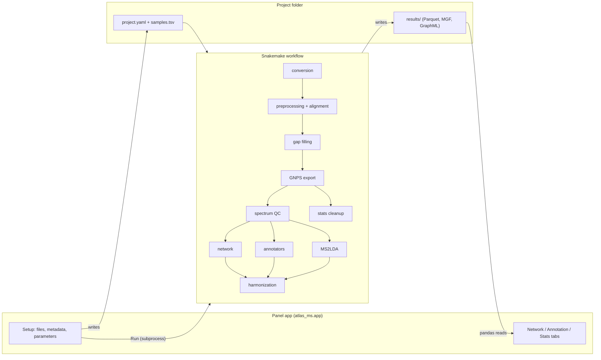

# ATLAS-MS architecture: v1

This document describes how the pipeline is built. The decisions behind it are
recorded in [`CLAUDE.md`](../CLAUDE.md). ATLAS-MS is a placeholder name
(Python package `atlas_ms`, command `atlas-ms`).

Milestones 1 (preprocessing, §6 stages 1–5) and 2 (network, §6 stages 6–8,
and the app's Setup and Network tabs, §11) are implemented. Milestone 3
(annotation) is implemented: spectral library search, rule-based lipid
annotation, SIRIUS 6 and MS2Query (tested with stand-ins here, to be tried
on your machine), harmonization and the Annotation tab. The other sections
describe the plan.

## 1. Scope

**v1 targets:** Linux, conda environments, local laptop/desktop (GPU optional),
10–100 raw files per project, positive ion mode (polarity stays a parameter),
lipid-focused but usable for general metabolomics, one project open at a time.

**v1 stages:** raw conversion (Thermo only) → preprocessing and alignment (pyOpenMS port of
UmetaFlow) → gap filling → GNPS/FBMN export → spectrum QC → network (modified
cosine *or* MS2DeepScore, chosen in the app) → molecular families →
annotation (library search, MS2Query, SIRIUS 6 REST API, lipid module) →
MS2LDA 2.0 → harmonization with Schymanski levels → stats → Panel app →
GraphML / Cytoscape export.

**Deferred to v2** (interfaces leave room for them): MIST-CF agreement flag,
network-aware rescoring of CSI:FingerID candidates, manual curation (incl.
Level 2b), network parameter tuning (done once the first real network exists),
Leiden / graph-tool, DreaMS, SNAP-MS, STEP/MT-GEM, negative mode and
positive/negative merging, Windows, extra database plugins (PubChem,
LOTUS/NPAtlas, COCONUT, GNPS2).

## 2. Big picture



There are three layers, and they only talk to each other through the project folder:

1. **`atlas_ms` Python package.** Holds all the logic and can be tested without Snakemake.
2. **Snakemake workflow.** Handles orchestration. Each rule is a thin script
   that calls the package. Tools with conflicting dependencies run in their
   own conda env.
3. **Panel app.** Edits the project config and metadata, launches Snakemake as
   a subprocess and reads `results/`. The app runs only cheap work itself:
   interactive stats, plots, and the push to Cytoscape.

## 3. Repository layout

```
.
├── CLAUDE.md                  # decisions, rules, pyOpenMS quirks
├── README.md                  # install and usage
├── docs/ARCHITECTURE.md       # this file
├── environment.yml            # core conda env (python + pip install -e .)
├── pyproject.toml             # the atlas_ms package and its Python dependencies
├── workflow/
│   ├── Snakefile              # loads/validates project.yaml + samples.tsv, includes the rules
│   ├── rules/                 # conversion, preprocessing, gap_filling, export, network, annotation (.smk)
│   ├── envs/                  # conversion.yaml, sirius.yaml, ms2query.yaml (+ ms2lda later)
│   └── scripts/               # thin entry points -> atlas_ms functions
├── src/atlas_ms/
│   ├── config.py              # param sections = single source of truth for parameters
│   ├── presets/               # instruments.yaml, adducts.yaml, lipid_rules.yaml
│   ├── project.py             # project folder + sample table
│   ├── runner.py, cli.py      # `atlas-ms init/run`
│   ├── logs.py                # rule log files (captures OpenMS C++ output too)
│   ├── preprocessing/         # msdata, features, alignment, annotate, linking, gap_filling, export
│   ├── mgf.py                 # small MGF reader (no matchms: fast to import)
│   ├── network/               # spectra (QC), scoring, graph (construction, families, layout, GraphML), model_files
│   ├── annotation/            # schema (candidate format), libraries, lipids, sirius(_input), ms2query, harmonize
│   ├── stats/                 # (M4) FBMN-STATS port
│   └── app/                   # Panel app: main, setup_view, run_view, network_view, annotation_view, plots, data
└── tests/                     # pytest; synthetic.py generates LC-MS runs
```

Rules running in an isolated env (MS2Query, MS2LDA) import only
`atlas_ms.annotation.schema`, which depends on nothing but numpy, pandas and
pyarrow. The Snakefile puts `src/` on `PYTHONPATH` for those rules.

## 4. Project folder

```
my_project/
├── project.yaml          # every parameter (written by the app, read by Snakemake)
├── samples.tsv           # sample, file (absolute path), sample_type, ATTRIBUTE_*
├── work/
│   ├── mzml/             # <s>.mzML: converted (Thermo) or a link to the input mzML
│   ├── features/         # <s>.featureXML + <s>.precursors.tsv (corrected precursor m/z)
│   ├── alignment/        # <s>.trafoXML (RT transformation)
│   ├── annotated/        # <s>.featureXML after adduct grouping + MS2 mapping
│   ├── gap_filling/      # targets.tsv, members.tsv, <s>.featureXML
│   ├── consensus/        # linked.consensusXML, gap_filled.consensusXML
│   └── export/           # gnps.consensusXML (input of the MGF writer)
├── results/
│   ├── features.parquet  quant.parquet
│   ├── gnps/             # ms2_spectra.mgf, quantification_table.txt, metadata.tsv,
│   │                     # iimn_supplementary_pairs.csv (GNPS FBMN, "OpenMS" format)
│   ├── network/          # nodes.parquet (family, community, x/y, QC), edges.parquet, network.graphml
│   ├── annotations/      # library.parquet, lipid_rules.parquet (one per source), candidates.parquet, best.parquet
│   ├── ms2lda/           # (M4) motifs.parquet, feature_motifs.parquet
│   └── stats/            # (M4) cleaned_quant.parquet, blank_flags.parquet
└── logs/                 # one log per rule and sample (incl. OpenMS output)
```

No modified copy of an mzML file is ever written. Precursor corrections and
RT transformations are small side files, re-applied in memory whenever a
step needs the spectra (`atlas_ms.preprocessing.msdata.load_run`).

- `atlas-ms run my_project` calls `snakemake --snakefile <repo>/workflow/Snakefile --directory my_project --configfile my_project/project.yaml --sdm conda --conda-prefix ~/.cache/atlas-ms/conda --cores N`. Rule environments are shared by all projects.
- Raw files are referenced by absolute path, not copied.
- `sample_type` takes the values `sample`, `blank` and `standard`. It is the only metadata the pipeline itself needs (for blank flagging). Every `ATTRIBUTE_*` column is only used by the stats and colouring.

## 5. Configuration

- **Single source of truth:** `atlas_ms.config` defines one
  `param.Parameterized` class per stage. The app renders them with
  `pn.Param`, and they serialize to and from `project.yaml`. The Snakefile
  loads and validates the YAML by instantiating the same classes, so the
  parameters are never defined twice.
- **Sections (milestone 1):** `presets` (names only, never read by
  processing), `instrument`, `adducts`, `feature_finding`, `alignment`,
  `linking`, `gap_filling`, `export`. Later milestones add their own
  sections.
- **Instrument presets** (`atlas_ms/presets/instruments.yaml`: `orbitrap`,
  `qtof`) set values in several sections at once:
  - MS1 mass error, noise threshold, peak width, minimum trace length;
  - the alignment, linking and gap-filling m/z tolerances;
  - later, the MS2 fragment tolerance and the SIRIUS profile.

  Orbitrap values are UmetaFlow's. Every value can be edited after a preset
  is applied. A new preset is just a YAML entry.
- **Polarity** drives the default adduct list, the SIRIUS adducts and which
  lipid rule set applies. Only `positive` is fully supported in v1 (the lipid
  rules are positive-mode only).
- **Adducts:** one editable list per polarity, with probabilities. The same
  list feeds MetaboliteAdductDecharger, SIRIUS (detectable adducts) and the
  lipid rules. Default positive list for lipids: `[M+H]+`, `[M+NH4]+`,
  `[M+Na]+`, `[M+H-H2O]+`, with `[M+K]+` optional.
- **Partial re-runs:** parameters are passed to rules as `params`, so
  Snakemake (≥ 8, default rerun triggers) re-runs only the affected rules
  when a value changes in the app. Changing a network cutoff does not
  re-run feature finding. This is tested: changing an export parameter re-runs
  only the export. A rule's params therefore hold only the sections it uses.

## 6. Workflow stages

| # | Stage | Env | Main outputs | Notes |
|---|---|---|---|---|
| 1 | Conversion (`convert_thermo`, `link_mzml`) | conversion | `work/mzml/*.mzML` | Thermo `.raw` → ThermoRawFileParser 1.4.5 (bioconda, vendor centroiding). A centroided `.mzML` input is symlinked, not copied. Other vendors: convert to centroided mzML elsewhere (msconvert support was dropped). |
| 2 | Feature finding (`find_features`, per run) | core | `work/features/*.featureXML`, `*.precursors.tsv` | pyOpenMS: precursor correction to the most intense MS1 peak → MassTraceDetection → ElutionPeakDetection → FeatureFindingMetabo → precursor correction to the feature. Refuses profile data. |
| 3 | Alignment and linking (`align`, `annotate_run`, `link`) | core | `work/alignment/*.trafoXML`, `work/consensus/linked.consensusXML` | MapAlignerPoseClustering (reference = run with the most features) → per run, on the aligned RT axis: MetaboliteAdductDecharger + IDMapper (MS2 → features) → FeatureLinkerUnlabeledKD. |
| 4 | Gap filling (`plan_gap_filling`, `fill_gaps`, `link_gap_filled`) | core | `work/consensus/gap_filled.consensusXML` | Consensus features missing in some runs become targets (with their measured isotope pattern), re-extracted with FeatureFinderMetaboIdent. Detected features are always kept. Re-extracted ones only fill gaps and are converted to the detected intensity scale (monoisotopic share × per-run median ratio). Then decharger → IDMapper (MS2 spectra without peaks are ignored) → linker again. Can be switched off. |
| 5 | Export (`export`) | core | `results/gnps/*`, `features.parquet`, `quant.parquet` | Detection-fraction filter, then features with MS2 are numbered first (`feature_id` = GNPS row ID = MGF SCANS). pyOpenMS GNPSMGFFile / GNPSQuantificationFile + IIMN pairs, and a GNPS metadata table from `samples.tsv`. We keep the GNPS FBMN schema and don't invent a new one. The Parquet tables cover *all* features (with or without MS2). (M3: SIRIUS `.ms` export with MS1 isotope patterns.) |
| 6 | Spectrum QC (`spectrum_qc`) | core | `work/network/spectra.pickle`, `spectrum_qc.parquet` | The MGF spectrum of each feature is cleaned (matchms default filters, fragments within ±17 Da of the precursor removed, intensities normalised). Spectra with fewer than `min_peaks` fragments (low default: lipid MS2 is sparse) get no spectral edges. **Never filter on the similarity score.** |
| 7 | Scoring (`score_spectra`) | core | `work/network/candidates.parquet` | matchms `ModifiedCosineGreedy` (fragment tolerance from the preset, with matched-fragment counts) or MS2DeepScore (pretrained model downloaded once to `~/.cache/atlas-ms/models` by `download_ms2deepscore_model`; CPU or CUDA). Keeps a pool of candidates: the best `candidates_per_spectrum` neighbours of each spectrum above `min_candidate_score`, so network cutoffs never re-run the scoring. |
| 8 | Network (`build_network`) | core | `results/network/nodes.parquet`, `edges.parquet`, `network.graphml` | Blank features (mean blank / mean sample > `max_blank_ratio`, only when `samples.tsv` lists blanks) lose their candidate edges. Then the GNPS steps: score cutoff + minimum matched fragments (cosine only) → mutual top-K → weakest edges removed while a family exceeds `max_family_size`. IIMN adduct edges are added. Families = connected components (1 = largest, -1 = singleton), Louvain communities inside them. The layout is precomputed: Kamada-Kawai per family (spring layout above 150 nodes), scaled so the median edge is 1.5 units long, then nodes are pushed apart until each has room for its largest drawn size (radius doubling per 10-fold intensity, from the mean or any single sample). Families are rotated to lie flat and packed in rows, tallest first, with the singletons in rows underneath. |
| 9 | Annotation (`prepare_library`, `combine_libraries`, `search_libraries`, `annotate_lipids`, `prepare_sirius_input`, `run_sirius`, `run_ms2query`) | core, sirius, ms2query | `annotations/<source>.parquet`, `annotations/library_summary.tsv`, `library_cleaning.tsv` | See §7, §9, §10. Each library is harmonized once per project (FragHub-like: matchms metadata harmonization and repair, offline; in-silico spectra recognised; same peak cleaning as the feature spectra), then all are combined with duplicates removed, and searched. |
| 10 | MS2LDA 2.0 | ms2lda | `ms2lda/*.parquet` | De novo motifs (number of motifs is a parameter) + MotifDB annotation. |
| 11 | Harmonization (`harmonize`) | core | `annotations/candidates.parquet`, `best.parquet` | Confidence levels, conflict flags, lipid name normalization (Goslin), RT trend per lipid class, family-level class consensus (MolNetEnhancer logic). See §8. |
| 12 | Stats cleanup | core | `stats/cleaned_quant.parquet` | FBMN-STATS steps that don't depend on the chosen comparison: blank removal, imputation, normalization. |
| 13 | Exports (`export_graphml`) | core | `network.graphml` (+ Cytoscape push from the app, M4) | GraphML carries the feature table and the best annotation (name, level, label, lipid class, flags, family class) as node attributes. |

**Network starting values** are placeholders taken from GNPS: cosine 0.7,
6 matched peaks, top-K 10, max component 100. MS2DeepScore gets its own
cutoff. As agreed, these are tuned once the first real network exists, and
the tuned values become the preset defaults.

## 7. Annotation plugins

Every annotator is one Snakemake rule that writes
`results/annotations/<source>.parquet` with the shared candidate schema
defined in `atlas_ms.annotation.schema` (as built):

| Column | Meaning |
|---|---|
| `feature_id`, `rank` | feature and candidate rank within this source |
| `source` | e.g. `library:inhouse_std`, `lipid_rules`; later `ms2query`, `sirius:csi`, `sirius:canopus`, `sirius:formula`, `sirius:elgordo` |
| `name`, `smiles`, `inchikey`, `formula`, `adduct` | candidate identity (any of them may be empty) |
| `score`, `score_name` | native score of the tool |
| `matched_peaks`, `mz_error_ppm`, `rt_error_s` | evidence |
| `library_kind` | `experimental` / `in_silico` / empty (not a library) |
| `lipid_class`, `lipid_name`, `lipid_level` | lipid class, Goslin-normalized name and Liebisch level (species / molecular species / sn-position / ...), filled by harmonization for any source whose name Goslin reads |
| `proposed_level` | the plugin's own Schymanski level (harmonization can only lower confidence, never raise it) |
| `evidence` | JSON text: matched diagnostic ions, library id, RT match, etc. |
| `reference_mz`, `reference_intensity` | the library spectrum of a library hit (for the app's mirror plot) |

`candidates.parquet` adds the final `level` and `lipid_species` (sum
composition, e.g. `PC 34:1`, used to compare sources). Compound classes
(ClassyFire / NPClassifier) come with CANOPUS.

Adding a database or API later (PubChem, LOTUS/NPAtlas, COCONUT, GNPS2)
means adding one of three plug-in kinds:

- **(a) SIRIUS custom structure database.** CSI:FingerID then ranks
  structures from that database. See §10.
- **(b) Enrichment lookup by InChIKey.** PubChem synonyms and CID, LOTUS
  taxonomic occurrence.
- **(c) Remote spectral search.** For example GNPS2.

### v1 annotators

1. **Spectral library search (matchms)** covers your MSP, MGF and JSON
   libraries plus public libraries.
   - Candidates are pre-filtered on precursor m/z.
   - Similarity is cosine by default, with entropy similarity as an option.
   - Each library is registered in the app with its kind (`experimental` or
     `in_silico`) and an optional `reference_standards: true` +
     `rt_tolerance`. Level 1 is only possible for those libraries.
2. **MS2Query** (own env) does exact and analog search against its
   GNPS-derived positive-mode library. As built: its CSV has the metascore,
   precursor m/z difference and ClassyFire / NPC classes, but no cosine or
   matched-fragment count, so its exact matches cannot be confirmed the
   2a way: every MS2Query candidate is level 3 (exact matches are marked in
   the evidence). Hits below `min_score` (0.7, the authors' reliable
   threshold) are not kept.
3. **SIRIUS 6 REST API** covers formula + ZODIAC, CSI:FingerID with COSMIC,
   CANOPUS and El Gordo lipids. See §10.
4. **Lipid module**: see §9.

MS2LDA motifs are attached to features as evidence. They never produce an
identity on their own.

## 8. Confidence levels (Schymanski) and harmonization

| Level | Rule in v1 |
|---|---|
| 1 | Match against a library flagged `reference_standards`: MS2 score ≥ cutoff, matched peaks ≥ n, precursor within ppm, **and** RT within tolerance. Without an RT match, the same hit is 2a. |
| 2a | MS2 match against an **experimental** library above the same thresholds (no RT). (Planned: an MS2Query exact match confirmed by cosine and matched peaks; MS2Query does not report those, so it stays at 3.) |
| 2b | Not assigned automatically in v1 (manual curation is v2). |
| 3 | CSI:FingerID candidates (**capped at 3 whatever the COSMIC confidence**), MS2Query hits, **in-silico** library match (e.g. LipidBlast), rule-based lipid annotation, El Gordo lipid species, CANOPUS class. |
| 4 | Top SIRIUS formula with ZODIAC score (SIRIUS score without ZODIAC) ≥ `min_formula_score` (0.9); the other formula candidates are 5. In v2, MIST-CF disagreement **adds a flag and doesn't change the level**. |
| 5 | Exact m/z only (LIPID MAPS m/z candidates are listed as suggestions). |

- **Caps (as built):** in-silico library hits, lipid rules, CSI:FingerID,
  CANOPUS, El Gordo and MS2Query are at most level 3; level 1 needs an RT
  error (a reference RT). A cap can only make a level less confident.
- **Best annotation per feature:** lowest level first, then a configurable
  source priority, then score.
- **Flags** (they never silently drop a candidate):
  - structure formula ≠ SIRIUS formula
  - CANOPUS class ≠ class of the structure candidate
  - lipid class disagreement between sources
  - RT outlier on the lipid ECN model (§9): per lipid class with at least 5
    confident species, a least-squares line RT ~ carbons + double bonds,
    robust to outliers (points with a large deleted residual are set aside
    before judging); flag beyond 0.5 min
  - feature flagged as blank
  - (as built) `ambiguous`: the best source has another, different candidate
    at the same level and score
- **Lipids report two scales:** each best lipid annotation carries the
  Schymanski level **and** the Liebisch structural level, e.g.
  `L3 · PC 16:0_18:1 (molecular species)`.
- **Family consensus:** per-family class consensus replaces the
  corresponding part of pyMolNetEnhancer (see CLAUDE.md, open item). It
  counts classes per molecular family and scores the consensus, stored on
  nodes as `family_class` and `family_class_score`.

## 9. Lipid annotation

Standard metabolomics tools (MS2Query, CSI:FingerID) are weak on lipids,
because lipid spectra are sparse and dominated by class-specific ions.
Several layers each contribute evidence, and harmonization combines them.

1. **Rule-based annotator** (built: `annotation/lipids.py`, rules in
   `atlas_ms/presets/lipid_rules.yaml`; `lipids.rules_file` points to your
   own copy).
   - For each class × adduct: diagnostic fragments, neutral losses and the
     expected nitrogen-rule parity, plus a generated species list (class ×
     total carbons × double bonds) matched on precursor m/z.
   - It returns the species level (`PC 34:1`). When chain-specific
     fragments or losses are present it returns the molecular-species level
     (`TG 16:0_18:1_18:2`).
   - Samples are mostly wastewater, so anything can be present: the rule
     set must cover the broad range of lipid classes, not one matrix.
     Restricting the search to chosen classes is a v2 option.
   - Starting positive-mode rule set:

     | Class | Adduct | Evidence |
     |---|---|---|
     | PC / LPC | `[M+H]+` | m/z 184.0733 (LPC also 104.1070) |
     | PC | `[M+Na]+` | NL 59.0735 |
     | SM | `[M+H]+` | 184.0733 + odd nominal m/z (2 N) |
     | PE | `[M+H]+` | NL 141.0191 |
     | PS | `[M+H]+` | NL 185.0089 |
     | PG | `[M+NH4]+` | NL 189.0402 |
     | PI | `[M+NH4]+` | NL 277.0562 |
     | Cer / HexCer | `[M+H]+` | sphingoid base ions 264.2686 / 282.2791 (d18:1); NL 162.0528 for hexose |
     | TG / DG | `[M+NH4]+` | NL of fatty acid + NH3 → chain composition |
     | CE | `[M+NH4]+` | m/z 369.3516 |
     | Acylcarnitines | `[M+H]+` | m/z 85.0284 |

   - As built, 26 classes: PC, PC O-, LPC, PE, PE O-, LPE, PE-NMe, PE-NMe2,
     PS, PG, LPG, PI, PA, CL, DG, TG, MGDG, DGDG, SQDG, DGTS, OL (ornithine
     lipids), Cer, HexCer, SM, CE, CAR. Each species formula is derived from
     one reference species of its class; a test checks them against Goslin.
   - Chains: fatty acid (+ NH3) losses for DG / TG (a composition is given
     only when it is the single one explaining every observed loss);
     sphingoid base ions for Cer / HexCer / SM (`Cer 18:1;O2/16:0`).
   - The score is the fraction of the rule's ions (and chain evidence)
     found. A matched rule proposes level 3. Features where no rule matched
     (including those without MS2) get the species matching their m/z as
     level 5 suggestions (`mz_only_candidates`).
   - Isobars are separated by their headgroup evidence. For example PC 34:1
     and PE 37:1 have the same formula.
2. **In-silico lipid library** (LipidBlast or equivalent MSP) is searched
   with the same matchms engine. Hits are capped at Level 3 because the
   spectra are not experimental.
3. **SIRIUS El Gordo** gives the lipid species in LIPID MAPS notation. It
   also tags CSI:FingerID candidates that match the predicted lipid class
   (`tagStructuresWithLipidClass`).
4. **Name normalization with Goslin** (`pygoslin`, MIT) parses every lipid
   name from every source into one shorthand and Liebisch level, so the
   sources can be compared and agree at the deepest level they share.
5. **RT plausibility (ECN model):** in reversed-phase LC, RT within a class
   rises with chain length and falls with unsaturation. A per-class fit of
   RT against ECN (e.g. C − 2·DB), trained on the confident annotations,
   flags outliers.
6. **Adduct consistency:** IIMN groups `[M+H]+`, `[M+Na]+` and `[M+NH4]+`
   of the same lipid. Class-typical adducts (TG/DG/CE → NH4+, PC → H+/Na+)
   serve as a plausibility check.
7. **LIPID MAPS (LMSD):** a local copy is used for MS1 candidate
   suggestions, as a SIRIUS custom structure DB, and for class IDs through
   Goslin's LIPID MAPS mapping.

**Limit of positive-only data:** many phospholipids (PC especially) give
little chain information as `[M+H]+`, so they mostly stop at the species
level. `[M+Na]+` helps a little. Negative mode (v2) is what unlocks
molecular species for PC/PE/PI/PS.

## 10. SIRIUS integration (new REST API)

**As built** (`annotation/sirius_input.py`, `annotation/sirius.py`, rules
`prepare_sirius_input` and `run_sirius`, `workflow/envs/sirius.yaml` with
`sirius-ms=6.5.4` and `py-sirius-ms=3.2+sirius6.5.4`, both on conda-forge;
off by default):

- The core env writes `work/sirius/input.json`: per feature with MS2, the
  MGF spectrum, the MS1 isotope pattern from the apex scan of the run where
  the feature is most intense (`msdata.RunReader.isotope_pattern`) and the
  adduct from the adduct grouping.
- The sirius env attaches to a running SIRIUS 6 (e.g. your GUI) or starts a
  headless one (`SiriusSDK.attach_or_start_sirius`), checks the login,
  creates `work/sirius/project.sirius` (kept, to open in the GUI), imports
  the features with `add_aligned_features` (our feature id as
  `externalFeatureId`: no `.ms` file and no id matching needed), runs one
  job and reads formula candidates (with `lipidAnnotation`), structure
  candidates (with `dbLinks`), MSNovelist's de novo structures
  (`get_de_novo_structure_candidates`, optional), the COSMIC confidences
  (`topAnnotations`) and the CANOPUS classes
  (`get_best_matching_compound_classes`).
- Login: when SIRIUS is not logged in, the account saved in the app
  (`~/.config/atlas-ms/sirius_account.json`, owner-only, never in the
  project or the rule parameters) is used, once the terms are accepted.
- A SIGTERM (Stop) leaves through the normal exit path, so a SIRIUS the
  rule started is always shut down. A SIRIUS
  started by the rule is shut down afterwards; your own is left running.
- Candidates: `sirius:formula` (top: 4 or 5), `sirius:elgordo`,
  `sirius:csi`, `sirius:canopus` (3). Source priority at equal level:
  library, lipid rules, El Gordo, MS2Query, CSI:FingerID, CANOPUS, formula.
- Tests use a fake client with the same methods as PySirius 6.5.4 (names
  checked against its generated source).

The original plan follows.

- **Packages:** SIRIUS 6.5.x as a local service (`sirius-ms` on
  conda-forge) and the PySirius client (`py-sirius-ms` on conda-forge,
  Apache-2.0). The client version is tied to the SIRIUS version, so both
  are pinned together in `workflow/envs/sirius.yaml`.
- **Starting the service:** the rule starts or attaches to a headless
  service with `SiriusSDK().attach_or_start_sirius(headless=True)`. It
  checks the login first and fails early with a clear message. CSI:FingerID
  and CANOPUS need your SIRIUS account; log in once with the SIRIUS GUI or
  `sirius login`.
- **Import:** our `.ms` export (MS1 isotope pattern + MS2) goes in through
  `import_preprocessed_data`. The SIRIUS feature id is mapped back to our
  `feature_id` through the external id. We don't use SIRIUS's own LC-MS
  preprocessing, so features stay identical everywhere.
- **Job:** one `JobSubmission` covers formula (+ ZODIAC), fingerprint +
  CANOPUS, structure DB search (bio DBs, optional expansive PubChem search,
  custom DBs) and El Gordo lipid tagging. MSNovelist is off by default.
  Progress is polled and written to `logs/progress/sirius.json` for the
  app.
- **Outputs:** formula candidates with the lipid annotation, structure
  candidates (the full list is kept for the v2 network rescoring) and
  CANOPUS classes, all written in the shared candidate schema.
- **Custom DBs:** created once per machine (`create_database` +
  `import_into_database`) and reused by every project. This is also how
  LIPID MAPS, COCONUT and LOTUS structures plug into CSI:FingerID later.

Automated tests use a fake client, because this cloud environment has no
SIRIUS account and no internet access to Bright Giant. Real runs happen on
your machine.

## 11. Panel app

Launched with `atlas_ms app`, which serves on `localhost` and opens the
browser. One project is open at a time.

**Sidebar:** open or create a project, instrument preset, polarity, adducts,
stage on/off switches, key parameters (advanced ones collapsed),
Run / Stop, progress bar and log pane.

**Tabs:**
0. **Setup.** Raw file picker, metadata editor (editable Tabulator
   pre-filled with the file names: `sample_type` + free `ATTRIBUTE_*`
   columns), library manager (add MSP/MGF/JSON, set kind, reference-standard
   flag, library RT unit, RT tolerance; built).
1. **Network.**
   - The network is clickable and supports box select. Colour by family,
     class, confidence level, stats result or intensity. Size by intensity,
     edge width by score.
   - pyOpenMS-viz plots of the selected feature: chromatogram across
     samples, MS2 mirror plot against the best hit, peak map (Datashader).
   - Feature list with the top-1 annotation, level and lipid name. Selecting
     a row selects the node, and the other way round.
2. **Annotation.**
   - Deep dive on the selected node or cluster: every candidate from every
     source with its level and flags, SIRIUS formula and structure lists,
     CANOPUS classes.
   - Lipid evidence, with the matched diagnostic ions highlighted on the
     spectrum.
   - MS2LDA motifs, with motif fragments highlighted.
   - Cluster summary: class and motif composition.
3. **Statistics.** Choose an attribute and groups → PCA + PERMANOVA,
   univariate tests (t-test / ANOVA + Tukey / Kruskal-Wallis + Dunn) with
   BH-FDR, volcano, heatmap, per-feature boxplots, lipid class sums. A
   "colour network by result" button sends the result to tab 1.

**Mechanics (as built in milestone 2):**
- **Page:** a `FastListTemplate`. The sidebar opens a project folder, creates
  one from a folder of raw files, and holds Run / Stop. Each view is a
  `param.Parameterized` class. The Network tab's `selected` feature ids are
  shared by the network (tap / box select), the feature table and the
  detail plots.
- **Data access:** pandas reads the Parquet results, and a small parser
  reads the MGF (matchms would add about 10 s to start-up). Chromatograms
  are extracted on demand from the mzML files, opened "on disc"
  (pyOpenMS `OnDiscMSExperiment`) and mapped onto the aligned RT axis with
  each run's trafoXML.
- **Network tab (reworked after the first real network):**
  - Layout: the network on the left and the plots of the selection on the
    right; the feature table below (25 rows per page, a "contains" search
    box above every column).
  - Nodes: the radius is in layout units (`graph.node_radius`: it doubles
    for every 10-fold intensity, relative to the median node, clipped two
    decades each way). The layout left room for each node's largest size,
    so nodes never overlap, at any zoom, and the tooltip shows one node
    only. Colour by family (colorcet glasbey_dark, 256 vivid colours),
    community, retention time, intensity, gap-filled values or spectrum QC.
    Size: same size, mean intensity, or the intensity in one chosen sample,
    all on the same scale.
  - Plots: RT in minutes; intensity ticks with one decimal. Peak labels are
    chosen from the most intense down, skipping peaks too close to a
    label already placed, so they never overlap. Two selected features
    give a mirror plot (relative intensity) with their edge score.
  - MS2 search: features whose spectrum holds all the given fragments, or
    neutral losses (precursor − fragment), within a Da tolerance, are
    circled in green.
- **Annotation tab (built):** it follows the Network tab's selection.
  Header with the best annotation, flags and family class consensus; every
  candidate of every source (most confident first, final and proposed
  level, scores, readable evidence); clicking a candidate shows its
  evidence: a mirror plot against the library spectrum for library hits,
  or the spectrum with the diagnostic ions found by a lipid rule marked.
  Below, the members of the molecular family and their annotations
  (clicking one selects it). The Network tab gained colour by confidence
  level and by lipid class (with a legend), and the best annotation in the
  feature table and tooltips.
- **Files and quitting (built):** raw files, libraries and models can be
  dropped on the app (browser uploads: copies written piece by piece into
  the project's `raw/` / `libraries/` folders or the model cache); typed
  paths use files in place. The SIRIUS card holds the account (saved
  outside the projects). Quit stops a running pipeline and the server,
  freeing the port.
- **Saving:** Setup edits are written only on Save or Run (Run saves first),
  and are validated by the same code as the pipeline.
- **Running Snakemake:** an async subprocess (the same command as
  `atlas-ms run`) whose output is streamed to the log. Progress is parsed
  from Snakemake's "N of M steps" lines. (Planned: long rules such as SIRIUS
  and MS2Query will also write `logs/progress/*.json`.)
- **Parallel work (built, `runner.py`):** `--cores` is a maximum (all
  available cores by default). Steps that load a whole run declare
  `mem_mb` (about 4 x the mzML), and Snakemake gets 80% of the available
  memory, so a laptop processes fewer runs at once instead of swapping.
  OpenMP / BLAS use one thread per job, except that per-run steps share the
  cores between the runs (cores / runs OpenMP threads each), and
  MS2DeepScore, SIRIUS and MS2Query take all cores for themselves.
- **Performance:** Bokeh WebGL output handles the few thousand nodes that
  100 files produce. Edge bundling is optional because it's slow.
- **Cytoscape (milestone 4):** a "Send to Cytoscape" button uses `py4cytoscape` to push
  the network with a style (group pie charts, labels = best annotation).
  Cytoscape desktop must be open. The GraphML file is always written, so
  Cytoscape isn't required.

## 12. Environments and external resources

| Env | Key contents | Why separate |
|---|---|---|
| core (`environment.yml` → `pyproject.toml`) | M1: Python 3.12, snakemake 9, pyopenms 3.5.0 (pinned), param, pandas, pyarrow, pyyaml. Later: matchms, ms2deepscore, pyopenms-viz, panel/holoviews/bokeh/datashader, networkx, duckdb, pygoslin, py4cytoscape, scikit-learn, statsmodels, scikit-bio | pyopenms-viz needs Python ≥ 3.12 |
| ms2query | ms2query 1.5.4 | pins matchms ≤ 0.26.4, ms2deepscore == 2.0.0, torch < 2.6 |
| ms2lda | ms2lda 2.0.1 | needs matchms ≥ 0.27, Python 3.11–3.12, spec2vec 0.8 |
| sirius | sirius-ms 6.5.x + py-sirius-ms (matching version) | pinned pair |
| conversion | thermorawfileparser 1.4.5 (on Mono) | bioconda |

**One-time downloads** go to a shared cache (`~/.cache/atlas_ms`, configurable),
through download rules with checksums:

| Resource | Used by | License / note |
|---|---|---|
| MS2DeepScore 2 pretrained model | network, MS2Query | Apache-2.0 (Zenodo) |
| MS2Query positive-mode library files | MS2Query | Zenodo; GNPS-derived |
| MS2LDA Spec2Vec model + MotifDB | MS2LDA | Zenodo / package data |
| GNPS public libraries (MGF) | library search | mostly CC0; verify per library |
| MassBank Europe (MSP) | library search | per-record CC licenses, some NC (fine for academic use) |
| LipidBlast or MS-DIAL lipid MSP (in silico) | lipid module | verify license before bundling |
| LIPID MAPS LMSD (SDF) | lipid module, SIRIUS custom DB | verify terms |

Libraries are never committed to the repo. They are downloaded or pointed
to by path.

## 13. Testing

- **Synthetic data:** `tests/synthetic.py` writes small centroided DDA runs
  (8 lipids: Gaussian elution, isotope peaks, class-specific fragments,
  RT shifts, a 3-fold TG change, a Cer 300 times weaker in one run, a DG
  without MS2).
- **Unit tests (pytest):** configuration, presets and sample tables now.
  Later: scoring, network construction, level rules, lipid rules and Goslin
  normalization.
- **Workflow tests:** the real Snakemake workflow on the synthetic study
  (about 15 s). They check that every compound is found once, the gap filling
  recovers the weak Cer, the TG fold change, PC [M+H]+/[M+Na]+ adduct grouping,
  matching ids between the Parquet tables and the GNPS files, the export when
  there is no MS2, dry-run DAGs (Thermo conversion, gap filling off) and that
  a parameter change re-runs only the affected rules. Then a real run on the
  user's dataset.
- **External tools** (SIRIUS, MS2Query, downloads) are mocked in the
  automated tests.
- **Limits of this cloud session:** zenodo.org, GitHub release downloads,
  PubChem, LIPID MAPS and MoNA are blocked by its network policy. Anything
  that needs them runs on your machine unless those hosts are allowed.

## 14. Milestones

1. **Skeleton + preprocessing (done).** Package, core env, config classes,
   project folder, CLI, Snakefile with conversion → preprocessing → gap
   filling → GNPS export, tests on synthetic data. Still to do: validation
   on the user's dataset against UmetaFlow's output.
2. **Network + first app (done).** QC, both scores, construction, families,
   layout, GraphML. App with the Setup and Network tabs (network, feature
   list, pyOpenMS-viz plots), Run button with log. Still to do: a first look
   at the user's real network, then tuning (milestone 5).
3. **Annotation (done, SIRIUS and MS2Query to be tried on your machine).**
   Library search (user libraries), rule-based lipid module (26 classes
   incl. bacterial ones), SIRIUS 6 REST API, MS2Query, harmonization with
   levels, flags and family consensus, Annotation tab, annotated GraphML.
   Still to do: public libraries (downloaded on your machine: this cloud
   session cannot reach them), the CANOPUS-vs-structure and formula
   disagreement flags.
4. **MS2LDA + stats + Cytoscape.** Statistics tab, Cytoscape push.
5. **Network tuning.** Tune the network parameters on the first real
   network and update the presets.
